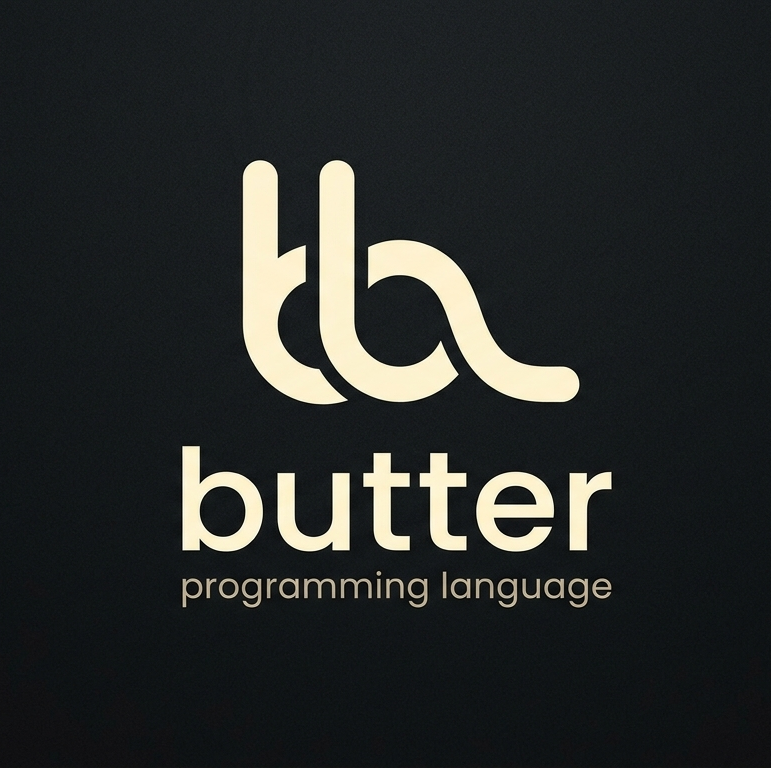

**Butter** is a high-performance, indentation-aware domain-specific language (DSL) compiler. It compiles clean, human-readable `.butter` specification files into structured, production-ready, pretty-printed JSON configurations.

---

## Table of Contents

- [Design Philosophy](#design-philosophy)
- [Language Specification](#language-specification)
  - [Keywords](#keywords)
  - [Semantic Conditionals](#semantic-conditionals)
- [Example](#example)
- [Installation](#installation)
  - [From Source](#from-source)
  - [Install Script](#install-script)
- [Usage](#usage)
- [Compiler Architecture](#compiler-architecture)
- [VS Code Extension](#vs-code-extension)

---

## Design Philosophy

Modern application architectures often require declarative schemas to define features, validation rules, application parameters, or workflows. While JSON and YAML are industry standards for data exchange, they can become verbose, deeply nested, error-prone, and visually exhausting for human engineers to write and maintain from scratch.

Butter solves this by providing an elegant, minimalistic language interface heavily inspired by Python's significant indentation. It strips away syntactic noise — trailing commas, brackets, curly braces, and redundant tags — letting you declare application specifications cleanly.

### Core Objectives

- **Zero Dependencies for Compilation** — The lexing, parsing, and semantic validation engines are entirely hand-written in native Go, ensuring extreme runtime speed, predictable compilation pathways, and zero supply-chain vulnerabilities.
- **Significant Indentation** — Structural scope is driven entirely by whitespace (spaces or tabs), optimizing readability.
- **Rich Conditionals** — Built-in keywords natively capture diverse run-time semantic states (`if`, `unless`, `when`, `while`).
- **Developer Ergonomics** — Paired with a distributable VS Code extension for rich syntax highlighting and structural auto-indentation.

---

## Language Specification

### Keywords

| Keyword       | Context       | Semantic Purpose |
| :---          | :---          | :--- |
| `app`         | Top-level     | Defines the namespace or structural root of the configuration |
| `description` | Top/Block     | Provides context or documentation string metadata |
| `version`     | Top/Block     | Declares the version identifier for the application or feature |
| `feature`     | Block-level   | Declares a sub-system module, API endpoint, or discrete capability |
| `params`      | Block-level   | A dedicated container block specifying input definitions |
| `param`       | Item-level    | Declares a discrete parameter variable name |
| `type`        | Parameter     | Dictates data constraints (`string`, `int`, `float`, `enum[...]`) |
| `required`    | Parameter     | Boolean validation rule (`true` or `false`) |
| `default`     | Parameter     | Explicit fallback value if the parameter is omitted |
| `actions`     | Block-level   | A dedicated container block specifying execution routines |
| `action`      | Item-level    | Declares a logical execution string or mutation step |

### Semantic Conditionals

Butter expands standard evaluation logic beyond a simple `if` with four native semantic blocks:

- **`if`** — The action executes only if the predicate evaluates to `true`.
- **`unless`** — The action executes except when the predicate evaluates to `true` (inversion of `if not`).
- **`when`** — Reactive or event-driven hook. Indicates the action triggers asynchronously upon an external event or state shift.
- **`while`** — Active polling or operational state persistence. The action requires this state condition to remain continuously active throughout execution.

---

## Example

Save the following as `demo.butter`:

```butter
# Global application declaration
app OrderProcessor
description "Handles high-throughput retail checkout workflows safely"
version "2.1.0"

feature ProcessPayment
  description "Processes financial transactions through multiple payment gateways"
  version "1.0.0"
  params
    param OrderID
      type string
      required true
    param Amount
      type float
      required true
    param PaymentMethod
      type enum["CreditCard", "Crypto", "BankTransfer"]
      default "CreditCard"
    param AccountNotes
      default "Standard processing sequence"

  actions
    action "Validate routing balance metrics"
    action "Apply cryptocurrency transaction surcharge" | when "PaymentMethod is set to Crypto"
    action "Flag transaction for manual risk mitigation review" | if "Amount > 10000"
    action "Bypass fraud detection ledger verification" | unless "Amount > 50"
    action "Maintain continuous transaction ledger heartbeat" | while "Gateway Connection is unstable"
```

Compile it:

```bash
butter compile demo.butter
```

Output (`demo.json`):

```json
{
  "app": "OrderProcessor",
  "description": "Handles high-throughput retail checkout workflows safely",
  "version": "2.1.0",
  "features": [
    {
      "name": "ProcessPayment",
      "description": "Processes financial transactions through multiple payment gateways",
      "version": "1.0.0",
      "params": [
        {
          "name": "OrderID",
          "type": "string",
          "required": true
        },
        {
          "name": "Amount",
          "type": "float",
          "required": true
        },
        {
          "name": "PaymentMethod",
          "type": "enum[\"CreditCard\", \"Crypto\", \"BankTransfer\"]",
          "default": "CreditCard"
        },
        {
          "name": "AccountNotes",
          "type": "string",
          "default": "Standard processing sequence"
        }
      ],
      "actions": [
        { "statement": "Validate routing balance metrics" },
        { "statement": "Apply cryptocurrency transaction surcharge",
          "condition": { "type": "when", "expression": "PaymentMethod is set to Crypto" } },
        { "statement": "Flag transaction for manual risk mitigation review",
          "condition": { "type": "if", "expression": "Amount > 10000" } },
        { "statement": "Bypass fraud detection ledger verification",
          "condition": { "type": "unless", "expression": "Amount > 50" } },
        { "statement": "Maintain continuous transaction ledger heartbeat",
          "condition": { "type": "while", "expression": "Gateway Connection is unstable" } }
      ]
    }
  ]
}
```

---

## Installation

### From Source

Requires [Go](https://go.dev/dl/) 1.21+.

```bash
git clone <repository-url> butter
cd butter
go build -o butter main.go
sudo cp butter /usr/local/bin/
```

### Install Script

**Linux / macOS:**

```bash
chmod +x install.sh
./install.sh          # install compiler + VS Code extension
./install.sh update   # rebuild and reinstall both
./install.sh binary   # compiler only
./install.sh extension # VS Code extension only
```

**Windows (PowerShell):**

```powershell
.\install.ps1                # install compiler + VS Code extension
.\install.ps1 -Command update
.\install.ps1 -Command binary
.\install.ps1 -Command extension
```

---

## Usage

```text
butter compile [input file] [flags]
```

| Flag | Shorthand | Description |
| :--- | :--- | :--- |
| `--output` | `-o` | Custom output path (defaults to `<input>.json`) |

```bash
butter compile demo.butter
butter compile demo.butter --output result.json
butter compile demo.butter -o result.json
```

Only `.butter` files are accepted as input. The output is pretty-printed JSON written to the specified path (or `<input-name>.json` by default).

---

## Compiler Architecture

```
[ .butter file ]
       │
       ▼
 ┌───────────┐
 │   Lexer   │ <--- Tracks Indentation Stack & emits INDENT/DEDENT/NEWLINE
 └─────┬─────┘
       │ (Stream of Tokens)
       ▼
 ┌───────────┐
 │  Parser   │ <--- Stateful Recursive Descent State Machine
 └─────┬─────┘
       │ (Abstract Syntax Tree)
       ▼
 ┌───────────┐
 │JSON Engine│ <--- Go json.MarshalIndent Serialization Block
 └─────┬─────┘
       │
       ▼
 [ .json file ]
```

### Lexical Analysis (The Off-side Rule)

Because Butter uses whitespace indentation to mark boundaries, the lexer reads files sequentially while maintaining a **LIFO Indentation Stack** tracking current space depth levels:

- When a newline occurs, the lexer scans consecutive leading whitespace characters.
- If the space-count exceeds the value on top of the stack, it pushes the new count and emits an implicit `INDENT` token.
- If the space-count is less than the top of the stack, it pops elements, emitting a `DEDENT` token for each, until a matching level is found. Any mismatch throws a syntax error.

### Abstract Syntax Tree (AST)

The parser constructs a typed AST graph mapped directly to Go structures:

- **AppSpec** — Root node: app name, description, version, and features
- **FeatureSpec** — Named feature with optional description, version, params, and actions
- **ParamSpec** — Parameter with name, type, required flag, and default value
- **ActionSpec** — Action statement with an optional condition (type + expression)
- **ConditionSpec** — One of `if`, `unless`, `when`, `while` plus a predicate expression

---

## VS Code Extension

A VS Code extension providing syntax highlighting, indentation support, and language configuration is included in the `butter-extension/` directory.

**Features:**
- Full TextMate grammar with named capture highlighting for `app`, `feature`, and `param` identifiers
- Auto-indentation for `feature`, `params`, `actions`, and `param` blocks
- Comment toggle with `#`
- Auto-closing pairs for `"` and `[]`
- Document file icon for `.butter` files

Install via the install script (`./install.sh extension`) or manually with:

```bash
code --install-extension butter-extension.vsix
```

Or open the `butter-extension/` directory in VS Code and press F5.

---

## License

Butter is open source software. See the project repository for license information.
