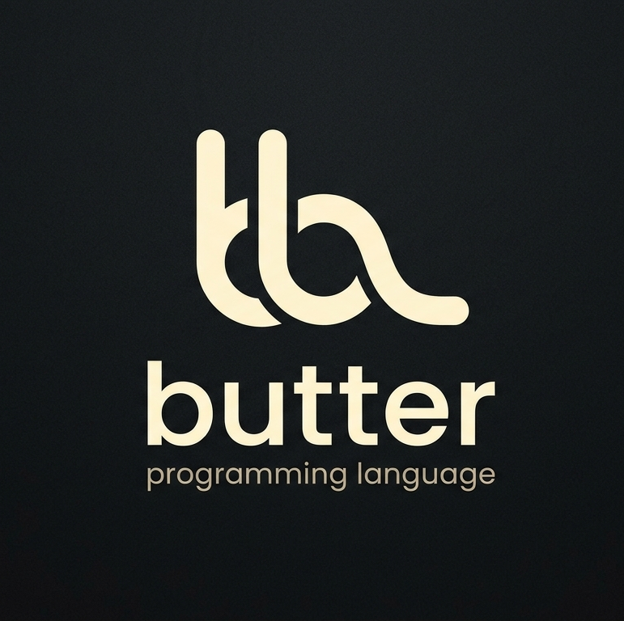

**Butter** is a specification language designed to communicate intent to AI agents. Write a `.butter` file that declares exactly what your system should do — parameters, constraints, and sequential execution steps — then compile it to a Markdown prompt and feed it to an AI agent. The agent follows the spec and produces implementations with higher first-pass accuracy. Less hallucination, less token waste, less back-and-forth.

---

## Table of Contents

- [Design Philosophy](#design-philosophy)
- [AI Workflow](#ai-workflow)
- [Language Specification](#language-specification)
  - [Keywords](#keywords)
  - [Parameter Syntax](#parameter-syntax)
  - [Action Syntax](#action-syntax)
  - [Response Syntax](#response-syntax)
  - [Return Syntax](#return-syntax)
- [Example](#example)
- [Installation](#installation)
  - [From Source](#from-source)
  - [Install Script](#install-script)
- [Usage](#usage)
- [Compiler Architecture](#compiler-architecture)
- [VS Code Extension](#vs-code-extension)

---

## Design Philosophy

AI agents are powerful, but they hallucinate, produce unexpected output, waste tokens on irrelevant paths, and rarely get things right in one shot. The problem isn't the AI — it's the instruction. Natural language prompts are ambiguous, and configuration formats like JSON/YAML describe data, not intent.

Butter is a **specification language for AI intent**. It sits between you and the AI: you write a structured `.butter` spec, compile it to a prompt, and feed that prompt to an AI agent. The spec constrains the AI's output space with typed parameters, enforce constraints, and deterministic action sequences — so the AI spends its context window on implementation, not interpretation.

### Core Principles

- **Intent over data** — JSON and YAML describe *what* data looks like. Butter describes *what to do*: features declare capabilities, parameters define typed inputs, and actions are sequential execution steps that must run one after another. The AI gets a complete execution model, not a data schema.

- **Sequential actions, deterministic results** — Actions inside a feature are synchronous, ordered steps. Each step performs one discrete operation. No parallel execution, no reordering, no guessing. This eliminates the most common source of AI hallucination: ambiguous sequencing.

- **Constrained output space** — Types (`string`, `integer`, `double`, `boolean`, `enum[...]`, `array[...]`), `enforce` constraints, and app-level `rules` define precise boundaries. The AI can't invent parameters that don't exist or skip steps that are required. Fewer degrees of freedom means fewer surprises.

- **One-shot prompting** — Feed the compiled spec to an AI agent with a simple instruction: "Implement this spec." The agent produces code with higher first-pass accuracy. No iterative back-and-forth, no ambiguous follow-ups, no wasted tokens on clarifying questions.

- **Zero-dependency core** — The lexer, parser, and semantic validator are hand-written in Go with zero third-party dependencies. No supply-chain risk, no bloat, predictable compilation every time.

---

## Language Specification

Butter uses strict 2-space indentation per nesting depth. Comments use `#` or `//`.

```text
# Root Application Specification
app <name>
├── description <string>
├── rules
│   └── <string>
├── feature <name>
└── endpoint <name> <route>

# Subsystem Feature Block Specification
feature <name>
├── description <string>
├── version <string>
├── params
│   └── <name> <type>
└── actions
    └── <string>
        └── enforce <string>

# Synchronous HTTP Endpoint Transport Block Specification
endpoint <name> <route>
├── description <string>
├── version <string>
├── method <string>
├── params
│   └── <name> <type>
├── responses
│   └── <name>
│       └── <name> <type>
├── actions
│   └── <string>
│       └── enforce <string>
└── returns
    └── <code> <ResponseName|string>
```

### Keywords

| Keyword       | Context       | Semantic Purpose |
| :---          | :---          | :--- |
| `app`         | Top-level     | Defines the namespace or structural root of the configuration |
| `description` | Top/Block     | Provides context or documentation string metadata |
| `version`     | Top/Block     | Declares the version identifier for the application, feature, or endpoint |
| `feature`     | Block-level   | Declares a sub-system module or discrete capability |
| `endpoint`    | Block-level   | Declares a synchronous HTTP transport contract with a route: `endpoint Name "route"` |
| `rules`       | App block     | A container block of app-level rules: `rules` followed by quoted strings |
| `method`      | Endpoint      | The HTTP verb, quoted: `method "POST"` |
| `params`      | Block-level   | A dedicated container block for parameter definitions |
| `actions`     | Block-level   | A dedicated container block for execution steps |
| `enforce`     | Action        | A constraint string directly below its parent action |
| `responses`   | Block-level   | A dedicated container block for response schema definitions |
| `returns`     | Endpoint      | Maps status codes to response payloads: `returns` followed by `200 ResponseName` or `500 "error"` |

### Parameter Syntax

Parameters are defined as `<name> <type>` lines under a `params` block. `<name>` is a snake_case identifier and `<type>` is one of `string`, `integer`, `double`, `boolean`, `enum[...]`, or `array[...]`:

```butter
params
  name string
  todo_id integer
  completed boolean
  priority enum["low", "medium", "high"]
  members_id array[integer]
```

### Action Syntax

Actions are bare quoted strings under an `actions` block, with optional `enforce <string>` grandchildren:

```butter
actions
  "Validate input is not empty"
  "Sanitize input"
    enforce "Reject empty strings"
  "Process payment"
```

### Response Syntax

Responses define reusable payload schemas under a `responses` block. Each response has a PascalCase header and nested snake_case `<name> <type>` field lines:

```butter
responses
  OrderSuccess
    order_id string
    total_amount double
    line_items array[string]
```

### Return Syntax

The `returns` block maps HTTP status codes (`100`–`599`) to either a referenced response name or a quoted string literal:

```butter
returns
  201 OrderSuccess
  500 "Internal server error"
```

---

## Example

Save the following as `demo.butter`:

```butter
# Global application declaration
app OrderProcessor
  description "Handles high-throughput retail checkout workflows safely"
  version "2.1.0"

  rules
    "Use Node on the backend"
    "Use React on the frontend"

feature ProcessPayment
  description "Processes financial transactions through multiple payment gateways"
  version "1.0.0"

  params
    order_id string
    amount double
    payment_method enum["credit_card", "crypto", "bank_transfer"]

  actions
    "Validate routing balance metrics"
    "Apply cryptocurrency transaction surcharge"
    "Flag transaction for manual risk mitigation review"
    "Maintain continuous transaction ledger heartbeat"
```

Compile it:

```bash
butter compile demo.butter
```

A longer working example with multiple features and an endpoint is available in [`todo.butter`](specs/todo.butter) and [`test-endpoint.butter`](specs/test-endpoint.butter). Each feature's actions run as sequential execution steps, one after another.

Output (`demo.prompt.md`):

```markdown
# [SYSTEM SPEC] OrderProcessor
> **Version:** 2.1.0
> **Description:** Handles high-throughput retail checkout workflows safely

### Rules
**CRITICAL:** The following rules MUST be respected throughout the entire implementation:

* Use Node on the backend
* Use React on the frontend

## Feature: ProcessPayment
**Version:** 1.0.0
Processes financial transactions through multiple payment gateways

### Params
* `order_id` (string)
* `amount` (double)
* `payment_method` (enum["credit_card", "crypto", "bank_transfer"])

### Execution Sequence
**CRITICAL:** Execute the following steps strictly in order. Do not proceed to the next step until the current one is complete.

1. **Validate routing balance metrics**
2. **Apply cryptocurrency transaction surcharge**
3. **Flag transaction for manual risk mitigation review**
4. **Maintain continuous transaction ledger heartbeat**
```

---

## Installation

### From Source

Requires [Go](https://go.dev/dl/) 1.21+.

```bash
git clone <repository-url> butter
cd butter
go build -o butter main.go
sudo cp butter /usr/local/bin/
```

### Install Script

**Linux / macOS:**

```bash
chmod +x install.sh
./install.sh          # install compiler + VS Code extension
./install.sh update   # rebuild and reinstall both
./install.sh binary   # compiler only
./install.sh extension # VS Code extension only
```

**Windows (PowerShell):**

```powershell
.\install.ps1                # install compiler + VS Code extension
.\install.ps1 -Command update
.\install.ps1 -Command binary
.\install.ps1 -Command extension
```

---

## Usage

```text
butter compile [input file] [flags]
butter fmt    [input file] [flags]
```

### `butter compile`

| Flag | Shorthand | Description |
| :--- | :--- | :--- |
| `--output` | `-o` | Custom output path (defaults to `<input>.prompt.md`) |
| `--format` | `-f` | Output format (default: `prompt`). Run `butter compile --help` to see all registered formats |
| `--check` | | Validate syntax and semantics without generating output |

```bash
butter compile demo.butter
butter compile demo.butter -f json
butter compile demo.butter -f yaml
butter compile demo.butter -f json -o result.json
butter compile --check demo.butter
butter --version
```

### `butter fmt`

Formats a `.butter` file according to standard conventions — normalizes indentation, removes blank lines after section keywords, and adds blank lines before `params`, `actions`, `responses`, `returns`, `rules`, and between top-level `feature`/`endpoint` blocks.

| Flag | Description |
| :--- | :--- |
| `--check` | Check formatting without modifying |

```bash
butter fmt demo.butter
butter fmt --check demo.butter
```

Only `.butter` files are accepted as input. Use `--check` to validate syntax and semantics without writing an output file — useful for editor integration and CI pipelines.

---

### Output Extensions

Butter's output layer is fully pluggable. The built-in JSON, YAML, and prompt serializers implement a simple three-method `Extension` interface. Anyone can write a new extension — for TOML, XML, Protobuf, Markdown, or anything else — and plug it in with a single import.

To write an extension, implement the `output.Extension` interface and call `output.Register()`:

```go
package toml

import "butter/pkg/output"

func init() { output.Register(tomlExt{}) }

type tomlExt struct{}
func (tomlExt) Name() string          { return "toml" }
func (tomlExt) FileExtension() string { return ".toml" }
func (tomlExt) Serialize(spec *ast.AppSpec) ([]byte, error) {
    // your serialization logic
}
```

Then add a blank import in `cmd/root.go` and rebuild. The extension appears automatically in `--format` help text and error messages.

Built-in extensions are documented in the [VS Code Extension](docs/extension.html) page.

## AI Workflow

Butter's true value emerges when you feed the compiled output to an AI agent. Here's the workflow:

1. **Write a `.butter` spec** — Declare your features, their typed parameters, and the sequential actions that implement each feature.

2. **Compile it** — `butter compile spec.butter` produces `spec.prompt.md`.

3. **Feed the prompt to an AI agent** — Include the compiled prompt with a simple instruction: *"Implement every feature in this specification. Each feature's actions are sequential execution steps — run them one after another in the listed order. Respect all types, rules, and enforce constraints."*

4. **Get higher first-pass accuracy** — The structured spec eliminates ambiguity. The AI knows exactly what to build, in what order, and with what constraints. Hallucination drops, token waste drops, and you get working code on the first try.

### Example

```text
Using this specification, build the complete application. Each feature's
actions are sequential execution steps — they must be implemented strictly one
after the other in the listed order, never in parallel or reordered.

[paste compiled spec.prompt.md here]
```

The spec defines *what* to build. The AI figures out *how*. That's the division of labour.

## Compiler Architecture

```
[ .butter file ]
       │
       ▼
 ┌───────────┐
 │   Lexer   │ <--- Tracks Indentation Stack & emits INDENT/DEDENT/NEWLINE
 └─────┬─────┘
       │ (Stream of Tokens)
       ▼
 ┌───────────┐
 │  Parser   │ <--- Stateful Recursive Descent State Machine
 └─────┬─────┘
       │ (Abstract Syntax Tree)
       ▼
 ┌───────────┐
 │ Semantic  │ <--- Checks: duplicate names, valid types, valid
 │  Analysis │       HTTP methods/status codes, response refs, enums
 └─────┬─────┘
       │ (Validated AST)
       ▼
  ┌──────────────┐
  │ Output       │ <--- Pluggable Extension Registry
  │ Extension    │       (json, yaml, prompt, + custom)
  │  Registry    │
  └──────┬───────┘
         │
         ▼
  [ .prompt.md / .json / .yaml / custom file ]
```

### Semantic Analysis

After parsing, a dedicated semantic analysis pass validates the AST against the following rules:

| Check | Severity | Description |
| :--- | :--- | :--- |
| Duplicate feature names | Error | Two features with the same name (includes first-definition line) |
| Duplicate parameter names | Error | Two params with the same name within a feature |
| Unknown parameter/field type | Error | Type is not `string`, `integer`, `double`, `boolean`, `enum[...]`, or `array[...]` |
| Duplicate enum value | Error | An `enum[...]` list contains the same value twice |
| Invalid HTTP method | Error | `method` is not one of POST/GET/PUT/DELETE/PATCH |
| Invalid status code | Error | `returns` code outside the range 100–599 |
| Undefined response ref | Error | `returns` references a `responses` name that isn't declared |
| Missing route/method | Error | Endpoint lacks a required `route` or `method` |

Errors block output generation.

### Lexical Analysis (The Off-side Rule)

Because Butter uses whitespace indentation to mark boundaries, the lexer reads files sequentially while maintaining a **LIFO Indentation Stack** tracking current space depth levels:

- When a newline occurs, the lexer scans consecutive leading whitespace characters.
- If the space-count exceeds the value on top of the stack, it pushes the new count and emits an implicit `INDENT` token.
- If the space-count is less than the top of the stack, it pops elements, emitting a `DEDENT` token for each, until a matching level is found. Any mismatch throws a syntax error.

### Abstract Syntax Tree (AST)

The parser constructs a typed AST graph mapped directly to Go structures:

- **AppSpec** — Root node: app name, description, version, rules, and features/endpoints
- **FeatureSpec** — Named feature with optional description, version, params, and actions
- **EndpointSpec** — Named endpoint with route, method, params, responses, actions, and returns
- **ParamSpec** — Parameter with a name and type
- **ActionSpec** — Action statement with optional enforce(s)

---

## VS Code Extension

A VS Code extension providing syntax highlighting, indentation support, and language configuration is included in the `butter-extension/` directory.

**Features:**
- Full TextMate grammar with named capture highlighting for `app`, `feature`, `endpoint`, and parameter identifiers
- **Butter Docs Colors** theme — a VS Code color theme that matches the docs color scheme (amber keywords, green strings, blue functions, purple params). Select "Butter Docs Colors" from the theme picker.
- On-save formatting — automatically applies `butter fmt` every time a file is saved, no configuration needed
- On-save linting — validates syntax via `butter compile --check` after formatting and surfaces errors with red squiggly underlines
- `Butter: Lint current file` command in the command palette
- `Butter: Format current file` command in the command palette
- Auto-indentation for `feature`, `endpoint`, `params`, `actions`, `responses`, `returns`, and `rules` blocks
- Configurable compiler path (`butter.compilerPath`)
- Comment toggle with `#` and `//`
- Auto-closing pairs for `"` and `[]`
- Document file icon for `.butter` files

Install via the install script (`./install.sh extension`) or manually with:

```bash
code --install-extension butter-extension.vsix
```

Or open the `butter-extension/` directory in VS Code and press F5.

---

## License

Butter is open source software. See the project repository for license information.
